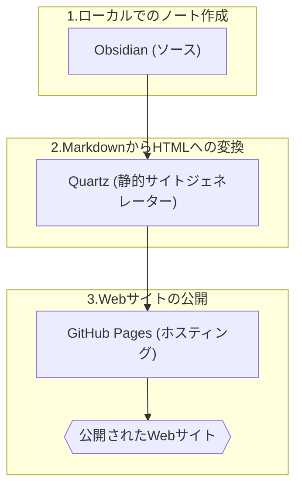

On this page, I describe how I publish [Plain text](https://notes.nicolevanderhoeven.com/Plain+text) notes online using:


  

> [!NOTE]-
>   
> 🖊️ How to publish Obsidian notes with Quartz on GitHub Pages: https://notes.nicolevanderhoeven.com/How+to+publish+Obsidian+notes+with+Quartz+on+GitHub+Pages  
> 🙏🏻 Gilbert Sanchez: https://links.gilbertsanchez.com/  
> 🖊️ Quartz documentation: https://quartz.jzhao.xyz/  
> 🖊️ GitHub documentation: https://docs.github.com/  
> 🖊️ GitHub Pages documentation: https://docs.github.com/en/pages  
> 🖊️ Obsidian documentation: https://help.obsidian.md/Home  
>   
> // TIMESTAMPS  
> 00:00 Intro  
> 00:34 What is Quartz?  
> 03:46 Step 1 - Download and install Quartz  
> 06:13 Step 2 - Set up your GitHub repository  
> 08:13 Step 3 - Set up your Obsidian vault  
> 12:59 Step 4 - Sync to GitHub  
> 14:22 Step 5 - Host your notes online with GitHub Pages  
> 16:21 (Optional) How to publish on a custom domain  
>   
>   
>   
> \---  
> // ABOUT ME  
> Site: https://nicolevanderhoeven.com  
> Mastodon: https://pkm.social/@nicole  
> Videos for my work at Grafana Labs: https://www.youtube.com/playlist?list=PL-1Nqb2waX4WfNnD52U1Spo2z47yrIjwo  
> Adobo & Avocados (with Marie Drake), a channel about intersectionality in tech: https://www.youtube.com/@adoboandavocados  
> Beyond the Character Sheet (with Leah Ferguson), a channel about TTRPGs: https://www.youtube.com/@beyondthecharactersheet  
>   
> // APPS I USE  
> \- Obsidian: https://obsidian.md  
> \- Readwise: https://readwise.io/nicole  
> \- Shortform: https://shortform.com/nicole  
> \- Reclaim: https://go.reclaim.ai/eg0tgbamp7cb  
> \- Snipd: https://link.snipd.com/Cx7S/nicole  
> \- Napkin: https://napkin.one/?via=nicole  
>   
> // GEAR  
> https://nicolevanderhoeven.com/gear/  
>   
> // WANT TO SUPPORT ME?  
> ❤️ Join my Patreon and get my sample vault with templates: https://patreon.com/nicolevdh  
> ☕ Buy me a coffee: https://ko-fi.com/nicolevdh  
>   
> Note: Some of the links above are affiliate links, which means I may get a small percentage when you sign up using those links. To see how I decide what to promote in this way, check out my Ethics Statement: https://nicolevanderhoeven.com/ethics/

# Obsidianのノートを「Quartz」で公開する方法

Obsidianで書き溜めたノートをオンラインで公開したいと考えたとき、公式の有料サービス「Obsidian Publish」が最初の選択肢になるでしょう。しかし、このサービスにはいくつかの欠点も存在します。

> 「Publishには欠点があります。まず有料であること、そしてセルフホスティングができないことです。また、私にとってはかなり長い間、動作が非常に遅いという問題もありました。」（動画 00:11〜）

さらに、カスタマイズの選択肢が少なく、自動化されたパイプラインに組み込むのが難しいという課題もあります。

この記事では、これらの課題を解決するObsidian Publishの無料代替ツール「**Quartz**」と、そのセットアップ方法をゼロから解説します。

## Quartzとは？ Obsidian Publishとの違い

### Quartzの正体

> 「Quartzはコミュニティプラグインではなく、Obsidianと非常によく連携する別のツールです。Obsidianを念頭に設計されているためですが、使用するためにObsidianが必須というわけではありません。」（動画 00:38〜）

Quartzは、Markdownコンテンツを完全な機能を持つWebサイトに変換する、高速でバッテリー駆動も考慮された静的サイトジェネレーターです。

### ノート公開の3つの要素

Markdownノートを公開するプロセスは、通常3つの要素で構成されます。

1.  **ツール（Tool）**: Markdownノートを作成・編集・保存するアプリケーション（Obsidian, VS Codeなど）。
2.  **変換（Conversion）**: MarkdownをWebで表示可能なHTML形式に変換する静的サイトジェネレーター。
3.  **ホスティング（Hosting）**: 変換されたHTMLファイルをオンライン上のサーバーに配置するサービス。

Obsidian Publishはこの3つすべてを内包したサービスですが、**Quartzが担うのは2番目の「変換」の部分のみ**です。そのため、別途ノートを作成するツールと、ファイルをホスティングする場所が必要になります。

### Obsidian PublishとQuartzの比較

| 特徴 | Obsidian Publish | Quartz + GitHub Pages |
| :--- | :--- | :--- |
| **コスト** | 月額8ドル | **無料** |
| **ホスティング** | Obsidianが管理 | 自己管理（GitHub Pagesなど） |
| **セットアップ** | **簡単** （Obsidian内で完結） | 専門知識が必要（Git, Terminal） |
| **カスタマイズ性** | 限定的 | **高い** （CSS, JS, プラグイン） |
| **自動化** | 難しい | **CI/CDパイプラインに統合可能** |
| **速度** | 遅い場合がある | **高速** |

## Quartzを使った公開ワークフロー

このチュートリアルで構築するワークフローは以下の通りです。



このプロセスを経て完成したサイトは、Obsidian Publishと同様にノート間のリンクが機能し、インタラクティブなグラフビューも利用可能です。

## Quartzのセットアップ手順

**注意点**: これからの手順は、ターミナル操作、Git、GitHub、Node.js、npmといった技術に慣れている方向けです。ほとんどのユーザーにとっては、Obsidian Publishの方が簡単な選択肢かもしれません。

### Step 1: Quartzのインストール

まず、ローカル環境にQuartzをセットアップします。

> ```
> # 1. Quartzのリポジトリをクローンする
> git clone https://github.com/jackyzha0/quartz.git
> 
> # 2. ディレクトリに移動する
> cd quartz
> 
> # 3. 必要なパッケージをインストールする
> npm i
> 
> # 4. Quartzのコンテンツを初期化する
> npx quartz create
> ```
> （動画 04:16〜）

`npx quartz create` を実行すると、コンテンツの初期化方法を尋ねられます。ここでは `Empty Quartz` を選択し、リンクの解決方法は `Treat links as shortest path` を選択するのがObsidianユーザーには推奨されます。

### Step 2: GitHubリポジトリのセットアップ

次に、WebサイトのファイルをホスティングするためのGitHubリポジトリを準備します。

1.  **GitHubで新規リポジトリを作成**: GitHub.comで新しいリポジトリを作成します。この際、`README` や `license` ファイルで**初期化しないように注意**してください。
2.  **ローカルリポジトリとリモートを接続**: Quartzのドキュメントに従い、`git remote add origin` コマンドで先ほど作成したリポジトリを `origin` として登録し、`git remote add upstream` で元のQuartzリポジトリを登録します。
3.  **コンテンツの同期**: 以下のコマンドで、ローカルの変更をGitHubにプッシュします。
    ```
    npx quartz sync
    ```

### Step 3: Obsidian Vaultとして設定

クローンしたQuartzのフォルダを、ObsidianでVaultとして開きます。

1.  Obsidianを起動し、「Open folder as vault」を選択。
2.  Step 1でクローンした `quartz` フォルダを選択します。
3.  これでObsidian上で直接ノートを編集できるようになります。テーマやプラグイン（`Templater`など）を導入して、好みの執筆環境を整えましょう。

### Step 4: コンテンツの作成と同期

Obsidianでコンテンツ（Markdownファイル）を作成・編集します。コンテンツは `content` フォルダ内に配置する必要があります。編集が終わったら、再度 `npx quartz sync` を実行して変更をGitHubに反映させます。

### Step 5: GitHub Pagesでのホスティング

GitHub Actionsを利用して、サイトを自動でデプロイ・公開します。

1.  **ワークフローファイルの作成**: ローカルのQuartzフォルダ内に、`.github/workflows/deploy.yml` というファイルを作成します。
2.  **設定のコピー**: Quartzの公式ドキュメント（Hosting > GitHub Pages）に記載されているYAML設定を `deploy.yml` にそのまま貼り付け、保存します。
3.  **GitHub Pagesの設定**:
    - GitHubリポジトリの `Settings` > `Pages` に移動します。
    - `Source` の項目で `GitHub Actions` を選択します。
4.  **変更をプッシュ**: `deploy.yml` を追加した変更を `npx quartz sync` で再度GitHubにプッシュします。これによりGitHub Actionsが起動し、サイトが公開されます。

公開されたサイトのURLは `<username>.github.io/<repository-name>` となります。

### Step 6 (任意): カスタムドメインの設定

独自のドメインをサイトに割り当てることも可能です。

1.  **DNSレコードの設定**:
    - ドメインを管理しているサービス（例：Porkbun）にログインします。
    - サイトに使用したいドメインのDNS設定画面を開きます。
    - GitHub Pagesが指定する4つのIPアドレスに対して、`Aレコード` を設定します。
2.  **GitHubでのドメイン設定**:
    - GitHubリポジトリの `Settings` > `Pages` に戻ります。
    - `Custom domain` フィールドに自分のドメイン名を入力し、`Save` をクリックします。
    - DNSのチェックが完了したら、`Enforce HTTPS` にチェックを入れます。

## まとめ

Quartzは、技術的な知識は必要ですが、無料で高速、かつ高いカスタマイズ性を持つ強力なノート公開ツールです。特に、自動化されたパイプラインに組み込みたい開発者にとっては最適な選択肢と言えるでしょう。

Obsidian Publishの手軽さも魅力的ですが、より多くのコントロールを求めるなら、Quartzを試してみてはいかがでしょうか。このツールは2023年のObsidian Gems of the Yearで「Best Tool」を受賞しており、その実力は折り紙付きです。